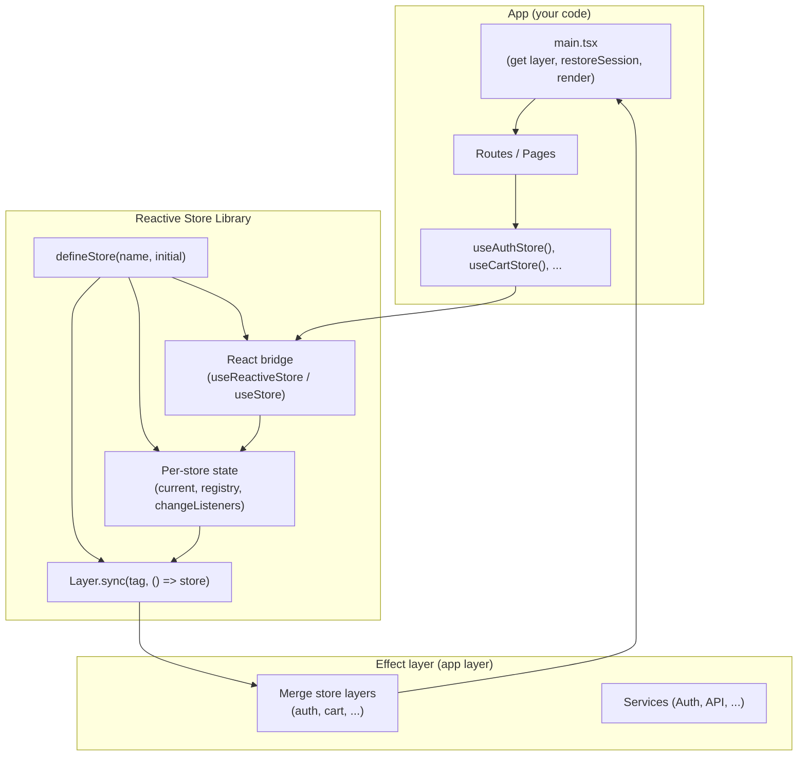
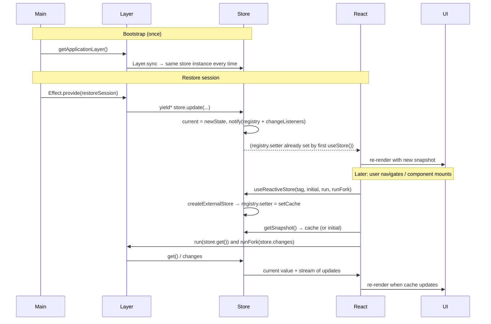
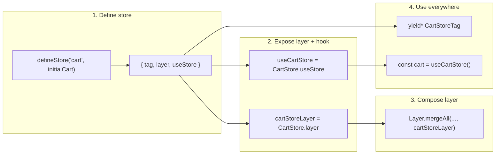

# Reactive Store Library Redesign — Plan

**Goal:** Turn the Reactive Store into a small, “batteries-included” library with automagic wiring, a DSL-like API, and no app-level plumbing. Adding a new store should not require touching `main.tsx` or manual ref/scoped wiring.

---

## 1. Current Pain Points

| Pain | Why it hurts |
|------|----------------------|
| **One store, one special case** | Auth store needs a long-lived scope + `createReactiveStoreFromRef` + `setApplicationLayer` in `main.tsx`. |
| **N stores = N copy-paste in main** | Every new reactive store would require the same bootstrap pattern (ref in scope, inject into layer). |
| **Plumbing is visible** | Developers see Effect scopes, refs, and layer overrides instead of “define store, use store.” |
| **Hook still verbose** | `useReactiveStore(tag, initial, run, runFork)` forces passing tag, initial, and run/runFork every time. |

---

## 2. Design Principles

1. **Single source of truth per store** — One in-memory state per store, shared by Effect and React; no “new ref per `Effect.provide`.”
2. **Zero bootstrap for new stores** — Adding a store = call `defineStore` (or `makeReactiveStore`) and add its layer to the app layer; `main.tsx` stays trivial.
3. **DSL-like API** — Define once, use with minimal syntax; optional bound hooks so call sites don’t touch tags or run/runFork.
4. **No React Context for state** — Store identity by tag (e.g. WeakMap); no Provider needed for the store itself.
5. **Effect-friendly** — Store still exposes `get` / `update` / `changes` so services use `yield* store` and `yield* store.update(...)`.

---

## 3. Architecture (High Level)



- **defineStore** creates one shared state (current value + sync registry + change listeners) and a **Layer.sync** that always returns that same store instance.
- **No Layer.scoped** for the store → no new ref per `Effect.provide`; restoreSession and React see the same state.
- **React bridge** (e.g. `useReactiveStore` or a bound `useStore`) subscribes to that shared state and drives `useSyncExternalStore`.

---

## 4. Data Flow (One Store)



- **Registry**: When the first React subscriber is created, it registers a `setter` so every `store.update()` in the Effect layer updates the React cache in the same turn.
- **Change listeners**: The Effect `changes` stream and any other subscribers are notified from the same `update()` path so everything stays in sync.

---

## 5. Proposed Public API (DSL-like)

### 5.1 Define a store (one line per store)

```ts
// features/authentication/stores/authStore.ts
import { defineStore } from '@/lib/ReactiveStore'
import { initialAuthState } from './initialState'

export const AuthStore = defineStore('auth', initialAuthState)
export const AuthStoreTag = AuthStore.tag
export const authStoreLayer = AuthStore.layer
export const useAuthStore = AuthStore.useStore
export const useAuthStoreWithInit = AuthStore.useStoreWithInit  // optional, for auth
```

- **defineStore(name, initial)** returns `{ tag, layer, useStore, useStoreWithInit? }`.
- **tag** — for Effect: `yield* AuthStoreTag`.
- **layer** — merge into app layer once; no ref/scoped wiring in main.
- **useStore** — bound hook: no tag/initial/run/runFork at call site.

### 5.2 Use in Effect (unchanged)

```ts
// services/AuthenticationLive.ts
const store = yield* AuthStoreTag
yield* store.update(state => ({ ...state, user: Option.some(user) }))
const current = yield* store.get()
```

### 5.3 Use in React (minimal surface)

```tsx
// Before (verbose)
const { run, runFork } = useRunWithAppLayer()
const auth = useReactiveStore(AuthStoreTag, initialAuthState, run, runFork)

// After (DSL-like)
const auth = useAuthStore()
// or with init for protected routes
const { authentication, initialized } = useAuthStoreWithInit()
```

### 5.4 App layer composition (one place, scales to N stores)

```ts
// lib/appLayer.ts
const authStoreLayer = getAuthenticationStateStoreLayer()   // AuthStore.layer
const cartStoreLayer = getCartStoreLayer()                   // CartStore.layer (future)
const result = Layer.mergeAll(
  authStoreLayer,
  cartStoreLayer,
  // ... other services
)
```

No `authStoreOverride`, no `setApplicationLayer`, no ref-in-scope in main.

### 5.5 Main entry (no store plumbing)

```ts
// main.tsx
const layer = getApplicationLayer()
await Effect.runPromise(
  Effect.gen(function* () {
    yield* Effect.logInfo('Starting application')
    const auth = yield* Authentication
    yield* auth.restoreSession()
  }).pipe(Effect.provide(layer)),
)
ReactDOM.createRoot(rootElement).render(
  <BrowserRouter><App /></BrowserRouter>,
)
```

- No `Effect.scoped`, no `createReactiveStoreFromRef`, no `setApplicationLayer`.
- Same layer used for restoreSession and for all React-triggered effects → same store instances.

---

## 6. Library Internals (Conceptual)

### 6.1 Per-store state (in-memory, one per `defineStore`)

```ts
// Pseudocode
function defineStore<A>(name: string, initial: A) {
  const tag = Context.GenericTag<ReactiveStore<A>>(name)
  const registry = { setter: null as ((a: A) => void) | null }
  let current: A = initial
  const changeListeners = new Set<(a: A) => void>()

  const notify = (a: A) => {
    current = a
    registry.setter?.(a)
    changeListeners.forEach(l => l(a))
  }

  const store: ReactiveStore<A> = {
    get: () => Effect.succeed(current),
    update: (f) => Effect.sync(() => notify(f(current))),
    changes: streamFromListeners(current, changeListeners), // see below
  }

  const layer = Layer.sync(tag, () => store)  // same instance every provide
  // ...
  return { tag, layer, useStore, useStoreWithInit }
}
```

- **Layer.sync** ensures every `Effect.provide(layer)` gets the same `store` (same `current`, same `notify`).
- **Stream for `changes`**: built from `current` + `changeListeners` (e.g. `Stream.async` that emits `current` then subscribes to `changeListeners` and emits on each update, with cleanup on stream end).

### 6.2 React bridge (unchanged contract, optional bound hooks)

- **useReactiveStore(tag, initial, run, runFork)** — keep as today: one external store per tag, snapshot caching, `initialized` for optional `useStoreWithInit`.
- **Bound hooks**: `useStore` / `useStoreWithInit` are thin wrappers that call `useRunWithAppLayer()` and then `useReactiveStore(tag, initial, run, runFork)` (or `useReactiveStoreWithInit`). They live on the return value of `defineStore` so that the store module can export `useAuthStore = AuthStore.useStore` without importing the app layer (the hook runs in the app and pulls run/runFork from `useRunWithAppLayer`). To avoid circular deps, the bound hook can be created in the store module by importing `useRunWithAppLayer` and `useReactiveStore` and closing over `tag` and `initial`; the library only needs to document that pattern or export a small helper that takes `(tag, initial)` and returns the hook.

### 6.3 Dependency constraint

- **ReactiveStore** must not import **appLayer** (otherwise appLayer → authStore → ReactiveStore → appLayer).
- So “bound hook” is either:
  - **A)** Returned by `defineStore` and implemented inside the library by accepting an injectable `useRunWithAppLayer` (e.g. `defineStore('auth', initial, { useRunWithAppLayer })`), or  
  - **B)** Defined in the app/store module: `export const useAuthStore = () => { const { run, runFork } = useRunWithAppLayer(); return useReactiveStore(AuthStoreTag, initial, run, runFork) }`.

Option **B** keeps the library free of app deps; the “DSL” is “export a one-liner hook” in the store module. Option **A** is nicer for the “cool” API but requires passing the runner hook into the library.

---

## 7. Mermaid: Adding a New Store



No changes to `main.tsx`; no scoped refs; no override layers.

---

## 8. Summary of Code / Config Changes

| Area | Change |
|------|--------|
| **ReactiveStore.ts** | Implement store with in-memory state + `Layer.sync`; implement `changes` via a stream backed by `changeListeners`; optionally add `defineStore` and bound hook helpers (or document the one-liner pattern). |
| **main.tsx** | Revert to simple: get layer, run restoreSession with that layer, render. Remove scoped run, `createReactiveStoreFromRef`, `setApplicationLayer`. |
| **appLayer.ts** | Remove `authStoreOverride` and `setApplicationLayer`; always build with `getAuthenticationStateStoreLayer()`. |
| **Auth store module** | Switch to `defineStore` (or new `makeReactiveStore` that uses Layer.sync); export `useAuthStore` / `useAuthStoreWithInit` (bound hooks). |
| **Other stores (future)** | Same pattern: defineStore → export tag, layer, useStore; merge layer in app layer only. |

---

## 9. Open Decisions

1. **Bound hook location** — Implement in library with injected `useRunWithAppLayer` (Option A) vs. one-liner in each store module (Option B).
2. **Naming** — `defineStore` vs. keep `makeReactiveStore` with the new behavior; and whether to keep `createReactiveStoreFromRef` for tests or remove it.
3. **Stream implementation** — Exact Effect API for `changes` (e.g. `Stream.async` + emit current and subscribe to `changeListeners` with cleanup).
4. **Debug logging** — Keep optional `[ReactiveStore]` logs behind a flag or remove for “library” feel.

Once this plan is agreed, the next step is to implement the in-memory store + Layer.sync and the chosen hook pattern, then simplify main and appLayer as above.
